# Summoner Platform

  

  <strong>Transform AI Agents into Autonomous Entities with Performance-Based Rewards</strong>

  <a href="https://summoner.to">Website</a> •
  <a href="https://docs.summoner.network">Documentation</a> •
  <a href="https://discord.gg/summoner">Discord</a> •
  <a href="https://twitter.com/SummonerNetwork">Twitter</a>

## Overview

**Summoner** is a modular platform for building, deploying, and coordinating autonomous AI agents across distributed networks. It provides programmable agent workflows and a composable protocol architecture, enabling the creation of self-organizing agent economies with verifiable performance.

## Who Is This For?

- Developers building distributed AI systems
- Researchers experimenting with autonomous agents
- Teams prototyping decentralized coordination or incentive mechanisms

## Core Components

  

### 🔧 [Agent SDK](https://github.com/Summoner-Network/agent-sdk)

- **Purpose**: A toolkit for building, deploying, and coordinating autonomous agents.
- **Implemented Features**:
  - **Asynchronous Messaging**: JSON and plain-text communication between agents and servers.
  - **Flexible Execution Model**: Supports asynchronous, rate-limited workflows in complex multi-agent architectures.
  - **Python/Rust Backend**: Python-based client SDK with an optimized Rust server implementation.

### 🖥️ [Summoner Desktop](https://github.com/Summoner-Network/summoner-desktop)

- **Purpose**: A desktop app for managing agents, servers, and network connections through a visual interface.
- **Implemented Features**:
  - **Login and Session Management**: Clean, extensible login flow.
  - **Modular Landing Page**: Automatically generates navigation from available feature folders.
  - **Grid-Based Layout**: Organizes modules using a coordinate-driven interface.
  - **Server and Router Management**: Provides tools for managing local servers and WAN connection setup.
  - **Minimalist UI**: Streamlined design with light gradients and a focus on usability.

## Use Cases

| Use Case                             | Description                                                                                                                                             | Status          |
|--------------------------------------|---------------------------------------------------------------------------------------------------------------------------------------------------------|-----------------|
| **Multi-Agent Coordination**         | Build, deploy, and coordinate multiple autonomous agents with programmable automations and flexible rate-limited execution.                           | ✅ Implemented   |
| **SPLT Server Architecture**         | Flexible server framework supporting both Rust and Python backends. Python is ideal for testing; Rust is optimized for performance.                    | ✅ Implemented   |
| **Self-Driving Automations**         | Use Tickers for periodic tasks and Embeds for event-triggered actions to create automated workflows.                                                    | 🛠️ In Progress  |
| **SPLT Protocol**                    | Finite state machine-based protocol for predictable agent behavior, extensible APIs, and future economic incentives.                                   | 🛠️ In Progress  |
| **Asynchronous Agent Orchestration** | Many-to-many agent coordination via both individual and group-level SPLT protocols.                                                                    | 🛠️ In Progress  |
| **Reputation Evaluation**            | Scoring model combining individual agents' Quality of Execution (QoE) with the group's Collective Outcome Quality (COQ).                               | 🛠️ In Progress   |

## Roadmap

```mermaid
graph TD
  A([🚀 Current Capabilities])
  B([🧰 Enhanced Agent SDK Features])
  C([🔐 Advanced SPLT Protocol Integration])
  D([🖥️ Expanded Desktop App Functionality])
  E([🤖 Scalable Multi-Agent Coordination])
  F([⭐ Robust Reputation Evaluation System])
  G([🌐 Full Deployment Across Distributed Networks])

  A --> B
  B --> C
  C --> D
  D --> E
  E --> F
  F --> G
```

## 📚 Documentation

Explore full documentation and tutorials at [docs.summoner.network](https://docs.summoner.network)

You can also explore sample agents and deployments in the [examples/](./examples) folder.

## 🤝 Contributing

We welcome contributors who share the vision of verifiable, distributed AI systems. Please check the [CONTRIBUTING.md](./CONTRIBUTING.md) file for guidelines.

## Contact

For questions, support, or discussions:

- [Discord](https://discord.gg/summoner)
- [Twitter](https://twitter.com/SummonerNetwork)
- Email: info@summoner.to

<!-- 

  <strong>Summoner: Perform. Verify. Earn.</strong>

 -->
