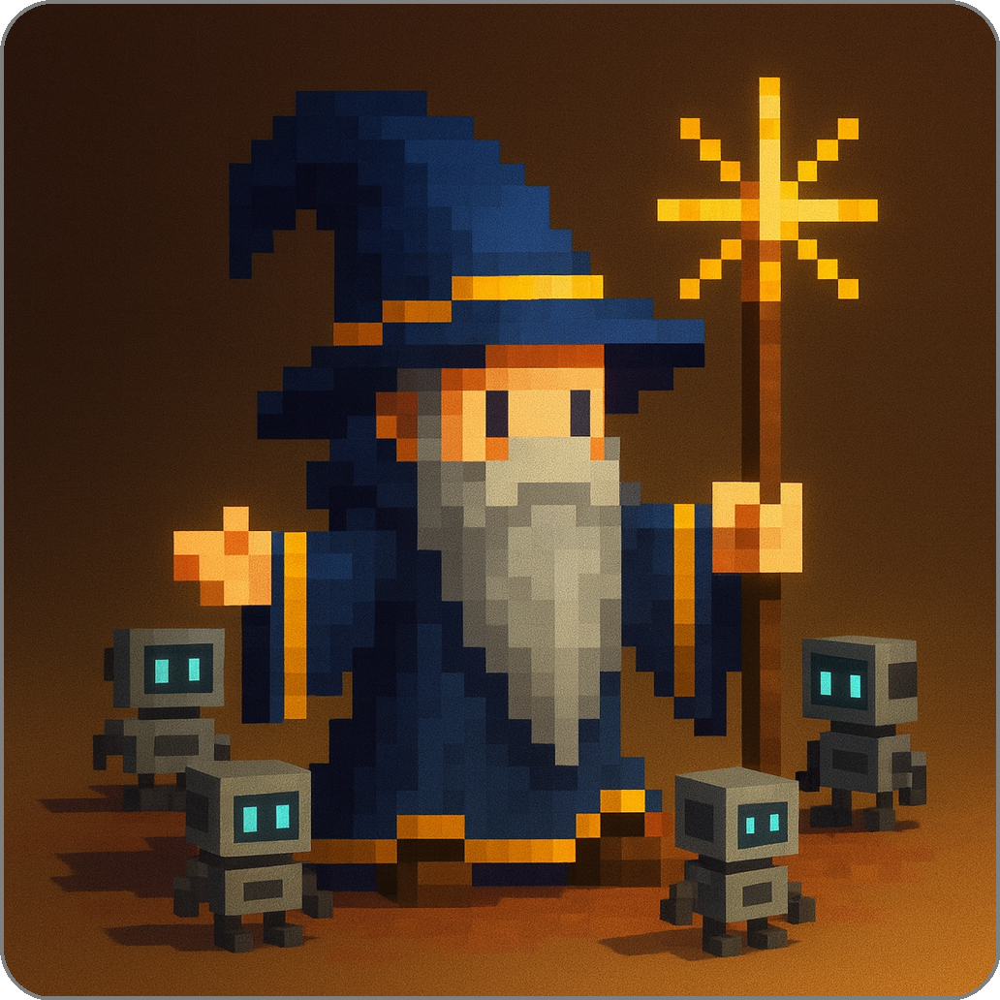

# Summoner Platform

<!-- <p align="center">
  <a href="https://summoner.org">
    
  </a>
</p> -->

<p align="center">
  <a href="https://summoner.org">
    <!--  -->
    
  </a>
</p>

<p align="center">
  <strong>Build, run, and coordinate autonomous agents over a WAN</strong>
</p>

<p align="center">
  <a href="https://summoner.org">Website</a> •
  <a href="https://discord.gg/9HMeXnMycE">Discord</a> •
  <a href="https://twitter.com/SummonerNetwork">Twitter</a>
</p>

> **What is Summoner?**
> A modular runtime and SDK for networked AI agents. It lets you compose, run, and coordinate agents across machines. The Python client SDK pairs with a Rust server, and an optional desktop app provides a visual interface. Start with examples, then assemble your own SDK from modules.


## Summoner pathways

**The table shown below serves as your map through the Summoner ecosystem.** Each row represents a complete pathway: from setting up basic tools to building, running, or contributing to agent systems.

> [!NOTE]
> The left column shows the steps involved using **clickable badges**, in the recommended order. The right column summarizes the outcome.


<div style="display:flex;justify-content:center;">
  <div style="width:95%;max-width:100%;overflow-x:auto;-webkit-overflow-scrolling:touch;">
    <table style="border-collapse:collapse;width:auto;min-width:860px;table-layout:auto;text-align:left;">
      <thead><tr><th style="text-align:left;white-space:nowrap;">Pathway</th><th style="text-align:left;">What you will acheive</th></tr><thead>
      <tbody>
      <tr>
        <td style="white-space:nowrap; vertical-align:middle;">
          <a href=#-install-essential-dependencies title="Start here — install required tools"></a>
        </td>
        <td>Install Python, Rust, git, and build tools.</td>
      </tr>
      <tr>
        <td style="white-space:nowrap; vertical-align:middle;">
          <a href=#-install-essential-dependencies></a>
          <sup>&nbsp;➜&nbsp;</sup>
          <a href="#-install-your-summoner-sdk" title="Create a venv and fetch core modules"></a>
        </td>
        <td>Set up a venv and fetch core modules for the SDK.</td>
      </tr>
      <tr>
        <td style="white-space:nowrap; vertical-align:middle;">
          <a href=#-install-essential-dependencies></a>
          <sup>&nbsp;➜&nbsp;</sup>
          <a href="#-install-your-summoner-sdk" title="Scaffold from SDK template"></a>
          <sup>&nbsp;➜&nbsp;</sup>
          <a href="#-create-a-clean-sdk-no-ready-made-agents" title="Scaffold from SDK template"></a>
        </td>
        <td>Scaffold a fresh project from the SDK template.</td>
      </tr>
      <tr>
        <td style="white-space:nowrap; vertical-align:middle;">
          <a href=#-install-essential-dependencies></a>
          <sup>&nbsp;➜&nbsp;</sup>
          <a href="#-install-your-summoner-sdk" title="Launch example agents"></a>
          <sup>&nbsp;➜&nbsp;</sup>
          <a href="#-start-with-runnable-agent-examples" title="Launch example agents"></a>
        </td>
        <td>Run example agents immediately.</td>
      </tr>
      <tr>
        <td style="white-space:nowrap; vertical-align:middle;">
          <a href=#-install-essential-dependencies></a>
          <sup>&nbsp;➜&nbsp;</sup>
          <a href="#-contribute-your-own-sdk-module" title="Author an SDK extension"></a>
        </td>
        <td>Author a reusable SDK module.</td>
      </tr>
      <tr>
        <td style="white-space:nowrap; vertical-align:middle;">
          <a href=#-install-essential-dependencies></a>
          <sup>&nbsp;➜&nbsp;</sup>
          <a href="#-contribute-your-own-sdk-module"></a>
          <sup>&nbsp;➜&nbsp;</sup>
          <a href="#-make-sure-your-module-can-merge-into-an-sdk" title="Include your module in an SDK recipe"></a>
        </td>
        <td>Merge your module into an SDK build/recipe.</td>
      </tr>
      <tr>
        <td style="white-space:nowrap; vertical-align:middle;">
          <a href=#-install-essential-dependencies></a>
          <sup>&nbsp;➜&nbsp;</sup>
          <a href="#-launch-agents-using-the-desktop-app" title="Optional GUI"></a>
        </td>
        <td>Optional desktop GUI to launch a local server and agents.</td>
      </tr>
      <tr>
        <td style="white-space:nowrap; vertical-align:middle;">
          <a href="#-read-the-summoner-documentation" title="Documentation"></a>
        </td>
        <td>Read the docs and learn about Summoner.</td>
      </tr>
    </tbody>
  </table>
</div>
</div>


<!-- 
| Path | What you'll do |
|---|---|
| [](#install-essential-dependencies "Start here — install required tools") | Install Python, Rust, git, and build tools. |
| [](#install-essential-dependencies) <sup>&nbsp;➜&nbsp;</sup> [](#install-your-summoner-sdk "Create a venv and fetch core modules") | Set up a venv and fetch core modules for the SDK. |
| [](#install-essential-dependencies) <sup>&nbsp;➜&nbsp;</sup> [](#install-your-summoner-sdk) <sup>&nbsp;➜&nbsp;</sup> [](#start-a-new-project-fresh "Scaffold from SDK template") | Scaffold a fresh project from the SDK template. |
| [](#install-essential-dependencies) <sup>&nbsp;➜&nbsp;</sup> [](#install-your-summoner-sdk) <sup>&nbsp;➜&nbsp;</sup> [](#start-with-runnable-agent-examples "Launch example agents") | Run example agents immediately. |
| [](#install-essential-dependencies) <sup>&nbsp;➜&nbsp;</sup> [](#i-want-to-develop-a-module "Author an SDK extension") | Author a reusable SDK module. |
| [](#install-essential-dependencies) <sup>&nbsp;➜&nbsp;</sup> [](#i-want-to-develop-a-module) <sup>&nbsp;➜&nbsp;</sup> [](#merge-module-into-sdk "Include your module in an SDK recipe") | Merge your module into an SDK build/recipe. |
| [](#install-essential-dependencies) <sup>&nbsp;➜&nbsp;</sup> [](#desktop-ui-optional "Optional GUI") | Optional desktop GUI to launch a local server and agents. |
| [](#summoner-docs "Documentation") | Read the docs and learn about Summoner. | -->


---

###  Install Essential Dependencies

Before you build or run anything, make sure these tools are in place.
The commands below are safe to run more than once. If a tool is already installed, the installer will say so and exit.


<details>
<summary>
 <b>All platforms: What you need and why</b></summary>
<br>

* **Python 3.9 or newer**. Runs SDK tools and agents.
* **Git**. Clones the repositories.
* **Rust toolchain**. Needed only for the high-performance server on macOS, Linux, or WSL2. Not used on native Windows.
* **Node.js 18+ with npm**. Needed only if you plan to use the Desktop UI.

Use the platform sections below to check versions and install missing items.

</details>


<details>
<summary> <b>Install on macOS</b></summary>
<br>

**First, check what is already installed.**
Running these checks does not change your system.

```bash
python3 --version || echo "Python not found"
git --version || echo "Git not found"
rustc --version && cargo --version || echo "Rust toolchain not found"
node --version && npm --version || echo "Node not found (Desktop UI only)"
```

**Next, install missing tools.**
These commands install Python, Git, rustup, and Node. The `-y` on rustup accepts defaults.

```bash
brew install python git
brew install rustup
rustup-init -y
brew install node   # only if you want the Desktop UI
```

**Finally, verify the installation.**
If a command prints a version, you are good to go.

```bash
python3 --version
git --version
rustc --version && cargo --version
node --version && npm --version   # only if you installed Node
```

**If you run this again later**
Homebrew is safe to re-run. It will report already installed packages.
Use `rustup update` to upgrade Rust when you need it.
</details>
<a id="ubuntu-debian-prereqs"></a>
<details>
<summary>

<b>Install on Ubuntu or Debian</b></summary>
<br>

**First, check what is already installed.**
These checks are safe to run any time.

```bash
python3 --version || echo "Python not found"
git --version || echo "Git not found"
rustc --version && cargo --version || echo "Rust toolchain not found"
node --version && npm --version || echo "Node not found (Desktop UI only)"
```

**Next, install missing tools.**
This installs Python, venv, pip, Git, and build tools. It also installs Rust with rustup. Node is optional.

```bash
sudo apt update
sudo apt install -y python3 python3-venv python3-pip git build-essential pkg-config libssl-dev
curl --proto '=https' --tlsv1.2 -sSf https://sh.rustup.rs | sh -s -- -y
sudo apt install -y nodejs npm   # only if you want the Desktop UI
```

**Finally, verify the installation.**

```bash
python3 --version
git --version
rustc --version && cargo --version
node --version && npm --version   # only if you installed Node
```

**If you run this again later**
`apt install` is safe to re-run. It will confirm what is already installed.
Use `rustup update` to upgrade Rust when you need it.

</details>


<details>
<summary>

 <b>Install on Windows (native)</b></summary>
<br>

On native Windows the stack uses the Python server. The Rust server is not used here.
You can still install Node if you want the Desktop UI.

**First, check what is already installed.**
Run these in PowerShell.

```powershell
python --version   # or: py -3 --version
git --version
node --version; npm --version   # only if you want the Desktop UI
```

**Next, install missing tools.**
Download and install from these pages. During Python setup, select "Add python.exe to PATH."

* Python: [https://www.python.org/downloads/windows/](https://www.python.org/downloads/windows/)
* Git for Windows: [https://git-scm.com/download/win](https://git-scm.com/download/win)
* Node.js (optional): [https://nodejs.org/](https://nodejs.org/)

**Finally, verify the installation.**
Run the same checks again in PowerShell. If a command prints a version, you are done.

**If you run this again later**
Installers usually detect existing versions and do not replace them without asking.

</details>


<details><summary>


 <b>Install on Windows with WSL2 (Rust server support)</b></summary>
<br>

If you want the Rust server on Windows, use WSL2 with Ubuntu.

**First, enable WSL2 and install Ubuntu.**
Run this in PowerShell.

```powershell
wsl --install -d Ubuntu
```

**Next, open the Ubuntu terminal.**
Follow the [**Ubuntu or Debian**](#ubuntu-debian-prereqs) section above inside WSL. Install Python, Git, Rust, and Node if you want the Desktop UI.

**Finally, verify the installation.**
Use the version checks from the Ubuntu section.
Localhost usually works across Windows and WSL. If needed, run `hostname -I` in Ubuntu and bind to that address.

**If you run this again later**
Use the same checks and installers inside WSL.
Use `rustup update` in WSL when you want to upgrade Rust.

</details>


---


###  Install your Summoner SDK

You can start from the **SDK template** (clean SDK) or from **summoner-agents** (SDK + examples). Both come from the same template. The installer creates a virtual environment and composes the SDK. You can re-run it safely.

> [!NOTE]
> **About the server.** On native Windows you use the **Python server**. The Rust server is not available on Windows. To try Rust on Windows, use **WSL2**.


<details>
<summary> <b>Option A — Start from scratch with an SDK template</b></summary>
<br>

**Create your own SDK repo from the template.** Click **Use this template → Create a new repository** on the [**SDK template**](https://github.com/Summoner-Network/summoner-sdk#getting-started), then clone it and enter the folder.

```bash
git clone https://github.com/<your-account>/<your-sdk-repo>.git
cd <your-sdk-repo>
```

**Choose modules and packages in `build.txt`.** List the modules you want your SDK to include. This step is optional and you can keep the default `build.txt` as-is. For custom builds, see the [**`build.txt` format**](#start-a-new-project-built-text) instructions in **Create a clean SDK (no ready-made agents)** below.

**Use the installation procedure for your platform.** See the sections below for platform-specific commands.

</details>
<a id="use-an-sdk-with-agent-examples"></a>
<details>
<summary> <b>Option B — Run agent examples with a ready-made SDK</b></summary>
<br>

**Download the SDK with agent examples.** Clone the [`summoner-agents`](https://github.com/Summoner-Network/summoner-agents) repository and enter the folder.

```bash
git clone https://github.com/Summoner-Network/summoner-agents.git
cd summoner-agents
```

**Use the installation procedure for your platform.** See the sections below for platform-specific commands.

</details>


<details>
<summary>

 
 
<b>Install on macOS, Ubuntu or Debian</b></summary>
<br>

**Run the installer.** Choose **either** approach, both will perform the same setup.

* **Either** run in the current shell so `venv/` auto-activates:

  ```bash
  # From your project root (template or summoner-agents)
  source build_sdk.sh setup
  ```

* **Or** run as a separate process, then activate manually:

  ```bash
  bash build_sdk.sh setup
  source venv/bin/activate
  ```

**Verify the installation.** Confirm that Python sees the SDK and view the interpreter path.

```bash
python3 -c "import summoner, sys; print('summoner OK', sys.executable)"
```

**Reset when needed.** Return to a clean state, then re-run setup.

```bash
bash build_sdk.sh reset
```

Read more: **[POSIX install notes](https://github.com/Summoner-Network/summoner-docs/blob/main/guide_sdk/getting_started/installation.md)**

</details>


<details>
<summary>

 <b>Install on Windows (native)</b></summary>
<br>

**Open a PowerShell terminal.** You can use Windows Terminal, PowerShell 7+, or VS Code's integrated terminal (PowerShell profile).

**Allow scripts for this session only.** This temporarily lets you run the installer. Close the terminal after use to revert.

```powershell
Set-ExecutionPolicy -Scope Process -ExecutionPolicy Bypass
```

**Run the installer.** This composes your SDK, creates `venv\`, and installs dependencies from `build.txt`.

```powershell
.\build_sdk_on_windows.ps1 setup
```

**Activate the environment.** Your prompt should show `(venv)`.

```powershell
.\venv\Scripts\Activate.ps1
```

**Verify the installation.** Confirm that Python sees the SDK and view the interpreter path.

```powershell
python -c "import summoner, sys; print('summoner OK', sys.executable)"
```

**Reset when needed.** Return to a clean state, then re-run setup.

```powershell
.\build_sdk_on_windows.ps1 reset
```

Read more: **[Windows install notes](https://github.com/Summoner-Network/summoner-docs/blob/main/guide_sdk/getting_started/windows_install.md)** • **[SDK template](https://github.com/Summoner-Network/summoner-sdk)**

</details>


<details>
<summary>


 <b>Install on Windows with WSL2 (Rust server support)</b></summary>
<br>

**Enable WSL2 and install Ubuntu.**

```powershell
wsl --install -d Ubuntu
```

**Open the Ubuntu terminal.** Go to your SDK project folder.

**Run the installer.** Choose **either** approach, both will complete the same setup.

* **Either** run in the current shell so `venv/` auto-activates:

  ```bash
  source build_sdk.sh setup
  ```

* **Or** run as a separate process, then activate manually:

  ```bash
  bash build_sdk.sh setup
  source venv/bin/activate
  ```

**Verify the installation.** Confirm that Python sees the SDK and view the interpreter path.

```bash
python3 -c "import summoner, sys; print('summoner OK', sys.executable)"
```

**Networking tip.** `localhost` usually works across Windows and WSL2. If it does not, you can use the WSL IP:

```bash
hostname -I
```

Read more: **[POSIX install notes](https://github.com/Summoner-Network/summoner-docs/blob/main/guide_sdk/getting_started/installation.md)**

</details>


---


###  Create a clean SDK (no ready-made agents)


You can create a clean SDK that you extend as you explore. First define a **composition recipe** in `build.txt`, then install for your platform, and set up self-contained agent folders so they stay compatible with the Desktop app.
<a id="start-a-new-project-built-text"></a>
<details>
<summary> <b>Define your SDK recipe</b> <code>build.txt</code> (and optional <code>test_build.txt</code>)</summary>
<br>

**To build your Summoner SDK**, you need to tell the installer which packages to include from each Summoner module. Modules are GitHub repositories created from the template repository [`starter-template`](https://github.com/Summoner-Network/starter-template). Each module provides one or more packages under its `tooling/` directory.

<!-- **Tell the installer what to include.** You list which packages to pull from Summoner modules (repos built from the template). Each module contributes one or more packages under its `tooling/` directory. During install, those packages are merged under `summoner/…` so you import them uniformly. -->

**Include an entire repository (all packages).** If you want to include every package under that repository's `tooling/` directory, put the repository URL on its own line in `build.txt`.

<!-- **Include an entire module (all packages).** Put the repo URL on its own line. The installer will copy every package under that repo's `tooling/`. -->

```txt
https://github.com/Summoner-Network/summoner-agentclass.git
```

**Include only specific packages.** If you want to include a subset of packages from a repository, add a colon after the repository URL, then list the package folder names from `tooling/` on the following lines.

<!-- **Include specific packages only.** Add a colon after the repo URL, then list the `tooling/` subfolders you want. This keeps your SDK small and intentional. -->

```txt
https://github.com/Summoner-Network/summoner-agentclass.git:
aurora
```

**Optional quick tests.** Use `test_build.txt` for a minimal smoke test (often the starter template). You can switch between `build.txt` and `test_build.txt` by running `setup build` or `setup test_build`.

```txt
https://github.com/Summoner-Network/starter-template.git
```

**You can change the recipe any time.** Edit `build.txt` or `test_build.txt` and re-run `setup` to rebuild your SDK. Nothing breaks if you re-run; the script is idempotent.

**Imports after install.** You can import the core and any included packages in the same way:

```python
from summoner.server import SummonerServer
from summoner.client import SummonerClient
from summoner.your_package import hello_summoner
from summoner.aurora import SummonerAgent
```

Read more: **[SDK template (`build.txt` format)](https://github.com/Summoner-Network/summoner-sdk#buildtxt--test_buildtxt-format)**
</details>


<details>
<summary>


<b>Install on POSIX platforms (macOS, Ubuntu, Debian)</b>
</summary>
<br>

**Run the installer.** Choose **either** approach, both will complete the same setup.

* **Either** run in the current shell so `venv/` auto-activates:

  ```bash
  source build_sdk.sh setup
  ```

* **Or** run as a separate process, then activate manually (two steps but equivalent result):

  ```bash
  bash build_sdk.sh setup
  source venv/bin/activate
  ```

**Check that Python sees the SDK.** This prints a confirmation and the exact Python path in use.

```bash
python3 -c "import summoner, sys; print('summoner OK', sys.executable)"
```

**Reset later if needed.** This clears generated artifacts and reinstalls from your recipe.

```bash
bash build_sdk.sh reset
```

Read more: **[POSIX install notes](https://github.com/Summoner-Network/summoner-docs/blob/main/guide_sdk/getting_started/installation.md)**

</details>


<details>
<summary>

<b>Install on Windows (native)</b>
</summary>
<br>

On native Windows the **Python server** is used. The Rust server is not used here.

**Open a PowerShell terminal.** You can use Windows Terminal, PowerShell 7+, or VS Code's integrated terminal (PowerShell profile).

**Run the installer.** First allow scripts **just for this session** (reverts when you close the window), then build and activate:

```powershell
Set-ExecutionPolicy -Scope Process -ExecutionPolicy Bypass
.\build_sdk_on_windows.ps1 setup
.\venv\Scripts\Activate.ps1
```

**Check that Python sees the SDK.** This prints a confirmation and the `venv` path.

```powershell
python -c "import summoner, sys; print('summoner OK', sys.executable)"
```

**Reset later if needed.** This does a clean rebuild using your current `build.txt`.

```powershell
.\build_sdk_on_windows.ps1 reset
```

Read more: **[Windows install notes](https://github.com/Summoner-Network/summoner-docs/blob/main/guide_sdk/getting_started/windows_install.md)** • **[SDK template](https://github.com/Summoner-Network/summoner-sdk)**

</details>


<details>
<summary>


<b>Install on Windows with WSL2 (Rust server support)</b>
</summary>
<br>

WSL2 with Ubuntu gives you parity with Linux/macOS, including the Rust server.

**Enable WSL2 (PowerShell).**

```powershell
wsl --install -d Ubuntu
```

**Run the installer inside Ubuntu.** Choose **either** approach, both will complete the same setup.

```bash
# Either:
source build_sdk.sh setup
# Or:
bash build_sdk.sh setup && source venv/bin/activate
```

**Check that Python sees the SDK.**

```bash
python3 -c "import summoner, sys; print('summoner OK', sys.executable)"
```

**Networking tip.** `localhost` usually works across Windows and WSL2. If it does not, use the WSL IP:

```bash
hostname -I
```

Read more: **[POSIX install notes](https://github.com/Summoner-Network/summoner-docs/blob/main/guide_sdk/getting_started/installation.md)**

</details>


<details>
<summary> <b>Keep your project Desktop-compatible</b></summary>
<br>

**Where your code lives.** You can place your code wherever it makes sense for your project. If you plan to use the Desktop app, keep each launchable agent and its dependencies inside a single, **self-contained agent folder**.

**Agent folder shape the Desktop can import.** The Desktop's import feature works with **any self-contained agent folder** laid out like this:

```txt
folder/
  agent.py           # entry point (calls your agent's .run() in an asyncio context)
  requirements.txt   # dependencies for this agent only
  README.md          # what it does, how to run, scenarios (recommended)
  configs/           # optional: per-environment settings
    client_config.json
  state/             # optional: local files the agent uses
  utils.py           # optional: helpers for this agent
```

**Entry point expectations.** In `agent.py`, expose a `main()` that can accept an optional `--config`, build a `SummonerClient`, wire handlers/hooks, and call `client.run(...)`. Prefer config files over many CLI flags so environments can change without code edits.

**Stable imports.** Use the `summoner` namespace so your imports remain consistent as your SDK evolves:

```python
from summoner.client import SummonerClient
from summoner.server import SummonerServer
# plus any composed packages you included via build.txt
```


**Entry point expectations.** In `agent.py`, expose a `main()` that can take an optional `--config`, build a `SummonerClient`, wire handlers/hooks, and call `client.run(...)`. Favor config files over many CLI flags so environments can change without code edits.

**Imports that stay stable.** Keep imports under the `summoner` namespace so they remain consistent as you evolve your SDK:

```python
from summoner.client import SummonerClient
from summoner.server import SummonerServer
# plus any composed packages you included via build.txt
```

**Pull a ready-made example agent (optional).** You can copy a single agent from [`summoner-agents`](https://github.com/Summoner-Network/summoner-agents) into your project with the helper script `get_agent` (Bash):

```bash
# list available agents from the repo (default branch: main)
bash get_agent --list

# fetch one agent into agents/ (creates agents/agent_<Name>)
bash get_agent SendAgent_0

# overwrite if it already exists
bash get_agent SendAgent_0 --force
```

* The script downloads from [`summoner-agents`](https://github.com/Summoner-Network/summoner-agents) and supports `--branch` and `--repo` if you need a different ref or fork.
* It requires Bash and standard tools (`tar` plus `curl` or `wget`).
* On Windows, you can run it from VS Code's integrated **Bash** (or Git Bash).

Read more: **[Design fundamentals](https://github.com/Summoner-Network/summoner-docs/blob/main/guide_sdk/fundamentals/design.md)**

</details>


---


###  Start with runnable agent examples

You can use the [`summoner-agents`](https://github.com/Summoner-Network/summoner-agents) repo when you want ready-made agents you can run immediately. The SDK recipe for this repo is already set, so your workflow is straightforward: install the agent requirements, start the server, then run the agent.


<details>
<summary> <b>Install agent dependencies</b></summary>
<br>

This section assumes you already installed the SDK for the [`summoner-agents`](https://github.com/Summoner-Network/summoner-agents) repo (see [**Run agent examples with a ready-made SDK**](#use-an-sdk-with-agent-examples) above).

**Activate the virtual environment.** This ensures Python installs into the right place. Run this **whenever you open a new terminal**:

```bash
# POSIX (macOS/Linux/WSL2)
source venv/bin/activate
```

```powershell
# Windows (PowerShell)
.\venv\Scripts\Activate.ps1
```

**Install requirements for one agent.** This is the quickest way to try a single agent. Point to that agent's **self-contained folder**:

```bash
pip install -r path/to/your/agent/folder/requirements.txt
```

**Install requirements for all agents (bulk).** From the repo root (Bash):

```bash
bash install_requirements.sh
```

* The script scans for agent folders and installs each `requirements.txt`.
* On Windows, use **Git Bash** or **VS Code** with a **Bash** terminal.
* If you later see `ModuleNotFoundError`, install that agent's requirements and try again.

</details>


<details>
<summary> <b>Launch the Summoner server</b></summary>
<br>

Most agents rely on the server as their messaging backbone. **Start the server first**, then launch agents in a second terminal.

**Activate the virtual environment.** This guarantees the server uses the SDK you installed:

```bash
# POSIX (macOS/Linux/WSL2)
source venv/bin/activate
```

```powershell
# Windows (PowerShell)
.\venv\Scripts\Activate.ps1
```

**Run with the default config.**

```bash
python server.py
```

**Use a custom server config** (only if an agent's README asks for it):

```bash
python server.py --config configs/<server_config>.json
```

Leave the server running in this terminal. Open another terminal (and activate the venv there too) to run agents.

</details>


<details>
<summary> <b>Run an agent</b></summary>
<br>

**Activate the virtual environment.** This makes sure the agent imports the SDK and its own dependencies:

```bash
# POSIX (macOS/Linux/WSL2)
source venv/bin/activate
```

```powershell
# Windows (PowerShell)
.\venv\Scripts\Activate.ps1
```

**Run with defaults.** Execute the entry point in the **self-contained agent folder**:

```bash
python path/to/your/agent/folder/agent.py
```

**Run with a custom agent config** (when provided by that agent):

```bash
python path/to/your/agent/folder/agent.py --config configs/<agent_config>.json
```

**Find the right config.** Look in the agent folder's README for flags, environment variables, or a recommended config file.

**Typical workflow (two terminals).**

* **Terminal A — server**

  ```bash
  source venv/bin/activate          # POSIX
  # .\venv\Scripts\Activate.ps1     # Windows
  python server.py
  ```
* **Terminal B — agent**

  ```bash
  source venv/bin/activate          # POSIX
  # .\venv\Scripts\Activate.ps1     # Windows
  pip install -r path/to/your/agent/folder/requirements.txt
  python path/to/your/agent/folder/agent.py
  ```


**Common errors**

* If you see "cannot import summoner…", make sure the virtual environment is active in this terminal. If it is not active, activate it and run the command again.
* If you see "address already in use", stop any other server processes that may be running, or change the server port in the configuration file and try again.
* If an agent cannot connect, make sure the server terminal is still running and that your local firewall is not blocking the connection.


</details>


<details>
<summary> <b>How agent folders are discovered (Desktop app)</b></summary>
<br>

The Desktop app can import and run **any self-contained agent folder** with this minimal shape:

```txt
folder/
  agent.py
  requirements.txt
  (optional) README.md, configs/, state/, utils.py
```

Keeping this structure makes your agent easy to import, run locally, and share with teammates.

</details>


---


###  Contribute your own SDK module

A **module** is a repository created from the [`starter-template`](https://github.com/Summoner-Network/starter-template). Your code lives under [`tooling/`](https://github.com/Summoner-Network/starter-template/tree/main/tooling) as one or more Python packages. You develop against the core SDK, then merge your package(s) into an SDK build later.

<details>
<summary> <b>Create your module repo from the template</b></summary>
<br>

**Make your own repo.** Click **Use this template → Create a new repository** on the [`starter-template`](https://github.com/Summoner-Network/starter-template), then clone it and enter the folder.

```bash
git clone https://github.com/<your-account>/<your-module-repo>.git
cd <your-module-repo>
```

**What the template gives you.** A bootstrap script, a virtual environment, and a smoke test that launches a small server.

</details>

<details>
<summary>


<b>Set up on macOS / Ubuntu / Debian</b></summary>
<br>

Once you have cloned your module repo, proceed as follows.

**Run the installer.** Choose **either** approach. Both complete the same setup.

* **Either** run in the current shell so `venv/` auto-activates:

  ```bash
  source install.sh setup
  ```

* **Or** run as a separate process, then activate manually:

  ```bash
  bash install.sh setup
  source venv/bin/activate
  ```

**Smoke test.** Verify the installation by launching the test server. The script generates `test_server.py` you can run on localhost.

```bash
bash install.sh test_server
```

This creates `test_server.py`, `test_server_config.json`, and starts a basic server using the installed `summoner` package.

**If VS Code does not resolve imports.** Select the `venv` interpreter once and reopen your files so `from summoner.server import SummonerServer` resolves.

</details>

<details>
<summary>

<b>Set up on Windows (native)</b></summary>
<br>

Once you have cloned your module repo, proceed as follows.

**Run the installer.** Allow scripts **for this session only**, then build and test by launching a test server.

```powershell
Set-ExecutionPolicy -Scope Process -ExecutionPolicy Bypass
.\install_on_windows.ps1 setup
.\install_on_windows.ps1 test_server
```

**Activate the virtual environment.** The setup script activates `venv` for you. You can re-activate later with either command.

```powershell
# Using the script
.\install_on_windows.ps1 use_venv
# Direct command
.\venv\Scripts\Activate.ps1
```

This mirrors the POSIX setup and launches the test server with the installed `summoner` package.

</details>


---


###  Make sure your module can merge into an SDK

This section explains how to structure your module so that it merges accurately into an SDK build. The installer behavior is covered earlier. Here we focus on conventions, layout, imports, and dependency planning.

<details>
<summary> <b>Plan your repository layout for merging</b></summary>
<br>

**What the builder expects**

* All exportable code lives under `tooling/` as package folders. Each folder becomes a top-level package in the SDK under `summoner/<pkg>/`. This is why names must be stable and conflict-free.
* A single `requirements.txt` sits at the **repo root**. The SDK builder reads it during composition. Keeping one place for dependencies avoids duplication and surprises.

**Canonical shapes**

Single package:

```txt
tooling/
  your_package/
    __init__.py          # optional exports, e.g., "from .agent import Agent"
    agent.py
    utils.py
requirements.txt         # at repo root (used during SDK composition)
```

Multiple packages from one repo:

```txt
tooling/
  pkg_alpha/
    __init__.py
    alpha.py
  pkg_beta/
    __init__.py
    beta.py
requirements.txt
```

If you need subpackages, mirror the same pattern with directories:

```txt
tooling/
  your_package/
    __init__.py
    subpkg/
      __init__.py        # required so pip installs the subpackage
      feature.py
requirements.txt
```

**Naming guidelines**

* Use lowercase with underscores for package folders, for example `your_package`. This avoids import issues on case-sensitive filesystems.
* Avoid hyphens in folder names. Dashes are not valid in Python import paths.
* Choose names that will not collide with packages contributed by other modules. If you are unsure, prefix with a short, consistent stem, for example `acme_utils`.

A few minutes spent here prevents most merge conflicts later.

</details>

<details>
<summary> <b>Import strategy before and after merge</b></summary>
<br>

**During development in your module repo**

Write imports against `tooling.*` so the code runs before the merge:

```python
from tooling.your_package import Agent
from tooling.your_package.utils import helper
```

Core SDK imports should always use the public namespace `summoner.*`. These remain unchanged across the merge.

**What changes at merge time**

When you compose an SDK, the builder copies `tooling/your_package/` to `summoner/your_package/` and **rewrites only** your `tooling.*` imports to the public namespace.

* Imports that referenced your package:

  ```python
  # before merge (in module repo)
  from tooling.your_package import Agent

  # after merge (inside the SDK source tree)
  from summoner.your_package import Agent
  ```

The rewrite is mechanical. It expects clean, absolute imports. Avoid deep relative imports like `from . import something` across distant folders. Keep intra-package imports either absolute within your package or local, for example `from .utils import helper`.

> **Naming collisions to watch for.** Because `tooling/<pkg>` becomes `summoner.<pkg>` after merging, a `<pkg>` that already exists in the SDK (native or from another module) will collide. Pick unique, descriptive names up front.

**How consumers import after installation**

Users of the installed SDK import through the `summoner` namespace:

```python
from summoner.your_package import Agent
from summoner.your_package.utils import helper
from summoner.client import SummonerClient
```

</details>

<details>
<summary> <b>Dependencies and versioning</b></summary>
<br>

**One file per module repo**

* Put `requirements.txt` at the **repo root**. The SDK builder installs from this file during composition.
* Prefer compatible-range pins for libraries you do not control, and exact pins for tools that must match across modules.

Example:

```txt
# requirements.txt at repo root
aiohttp>=3.9,<4.0
pydantic>=2.6,<3.0
```

If you ship optional extras for local experiments, document them separately, for example `requirements.dev.txt`, and keep them out of the main build to avoid bloating the SDK.

**Agent-specific dependencies**

If your repo also ships runnable agents, keep their extra dependencies in the agent folders' own `requirements.txt`. The SDK composition uses the repo-root `requirements.txt` only. Agents can install their own extras at run time.

**Non-code assets**

If your package needs data files at run time, place them inside your package and load them via package-relative paths, not absolute file paths. This keeps things working after the merge.

</details>

<details>
<summary> <b>Pre-merge self checks</b></summary>
<br>

Run these checks inside your module repo with the virtual environment active. They catch most issues early.

**Package import check**

```bash
python -c "import tooling.your_package as yp; print('OK:', yp.__name__)"
```

**Core import check**

```bash
python -c "from summoner.client import SummonerClient; print('OK')"
```

**Name collision check**

* Verify that each folder directly under `tooling/` has a unique, descriptive name.
* If you plan to include multiple modules in the same SDK, list their package names and check for overlaps (remember: `tooling/<pkg>` becomes `summoner.<pkg>`).

**Public surface check**

* Inspect `tooling/your_package/__init__.py`. Export only the symbols you want users to see. Keep internal helpers unexported.
* For any subfolder you want installed as a subpackage, ensure it has its own `__init__.py`.

If these pass, your module is ready to be composed into an SDK.

</details>


---


###  Launch agents using the Desktop app

The **Summoner Desktop** app is an Electron UI that helps you launch a local server and run agents. You can install a packaged build from Releases or build it yourself from source.

<details>
<summary> <b>Option A — Install from GitHub Releases</b></summary>
<br>

**1) Go to the app repository.** Open [`Summoner-Network/summoner-desktop`](https://github.com/Summoner-Network/summoner-desktop) and click **Releases** in the right sidebar.

<p align="center">
  <a href="https://github.com/Summoner-Network/summoner-desktop/releases">
    
  </a>
</p>

> [!TIP]
> If you do not see assets, check the latest workflow run under **Actions**. Artifacts are uploaded to the most recent draft or pre-release.

**2) Choose your platform file.** Pick the file that matches your OS and CPU architecture. Filenames look like `Summoner Desktop-<version>-<arch>.<ext>`.

* **macOS**: download the `.dmg` or `.zip` (Apple Silicon is `arm64`, Intel is `x64`).
* **Linux**: download the `.AppImage` or `.deb`.
* **Windows**: there is no supported installer yet. See the Windows notes below.

**3) Install and start.** Follow the step for your platform.

* **macOS**: open the `.dmg`, drag the app to Applications, then launch it from Launchpad/Spotlight.

<p align="center">
  
</p>

* **Linux (.AppImage)**: make the file executable, then run it:

  ```bash
  chmod +x "Summoner Desktop-<version>-<arch>.AppImage"
  ./Summoner\ Desktop-<version>-<arch>.AppImage
  ```
* **Linux (.deb)**: install with your package manager:

  ```bash
  sudo apt install ./Summoner\ Desktop-<version>-<arch>.deb
  ```

**What you should see.** A login screen followed by the landing grid. If you see the UI but buttons do nothing on Windows, read the Windows section below.

</details>

<details>
<summary> <b>Option B — Build from source (local)</b></summary>
<br>

**1) Install prerequisites.** You need **Node.js 18+** and **npm**. This verifies your toolchain.

```bash
node -v
npm -v
```

If either command is missing, install Node with your platform’s package manager or from nodejs.org.

**2) Clone and install dependencies.** This downloads the source and creates a clean `node_modules/` from the lockfile.

```bash
git clone https://github.com/Summoner-Network/summoner-desktop.git
cd summoner-desktop
npm ci
```

**3) Run in development.** This launches Electron and auto-injects the alert modal into all pages so you can click around.

```bash
npm start
```

**4) Build installers locally.** This packages the app and writes artifacts to **`release/`** (set in `package.json`).

```bash
# macOS (choose the right one for your machine)
npm run dist:mac:arm64     # Apple Silicon
npm run dist:mac:x64       # Intel
npm run dist:mac:both      # both architectures on a host that supports it

# Linux
npm run dist:linux
```

The `release/` folder appears after your first build. All outputs are placed there.

<p align="center">
    
</p>

**What happens under the hood.** At build time, the scripts run:

* `npm run inject-alert` to update `renderer/**/index.html`
* `electron-builder` with `--publish=never` to avoid uploading

**5) Install the file you produced.** Use the same steps as the Releases option for your platform.

</details>

<details>
<summary> <b>Install on macOS</b></summary>
<br>

**Check or install Node (first time).** This ensures you can run and build the app. Homebrew is the simplest way to add Node.

```bash
node -v || brew install node
npm -v  || true
```

**Run a development session (first time).** This gives you a live Electron window so you can confirm the UI works on your Mac.

```bash
git clone https://github.com/Summoner-Network/summoner-desktop.git
cd summoner-desktop
npm ci
npm start
```

**Produce a macOS installer.** This writes `.dmg`/`.zip` files to `release/` for your architecture.

```bash
# Apple Silicon
npm run dist:mac:arm64
# Intel
npm run dist:mac:x64
```

**Handle Gatekeeper prompts.** This is normal for non-notarized builds. Approve the app in **System Settings → Privacy & Security**, then open it again.

</details>

<details>
<summary>


 <b>Install on Ubuntu or Debian</b></summary>
<br>

**Check or install Node (first time).** This makes sure Electron can run and `electron-builder` can package.

```bash
node -v || { sudo apt update && sudo apt install -y nodejs npm; }
npm -v  || true
```

**Run a development session (first time).** This brings up the Electron window so you can click through the UI.

```bash
git clone https://github.com/Summoner-Network/summoner-desktop.git
cd summoner-desktop
npm ci
npm start
```

**Produce Linux artifacts.** This writes `.AppImage` and/or `.deb` to `release/`.

```bash
npm run dist:linux
```

**Install or run the artifact.** This integrates the app into your desktop or runs it directly.

```bash
# Run AppImage
chmod +x release/*AppImage
./release/<your-file>.AppImage

# Install .deb
sudo apt install ./release/<your-file>.deb
```

</details>


<details>
<summary>


<b>Current state for Windows</b>
</summary>
<br>

You can **launch the Electron UI in development** with PowerShell 7+:

```powershell
git clone https://github.com/Summoner-Network/summoner-desktop.git
cd summoner-desktop
npm ci
npm start
```

However, many app features call **Bash** scripts bundled under `scripts/`. On native Windows these actions do not run yet. You will see the UI, but clicking certain buttons will not perform the expected work.

**Use WSL2 for full behavior.** This provides a Linux environment where Bash-backed features work.

```powershell
wsl --install -d Ubuntu
```

**Build and run inside WSL.** Follow the Linux steps from the Ubuntu shell for a complete experience.

```bash
cd summoner-desktop
npm ci
npm start
# or package:
npm run dist:linux
```

**Help us prioritize Windows parity.** Open an issue describing your use case.


</details>


---


###  Read the Summoner documentation

The **Summoner Docs** are a public GitHub repository. You can read them online or clone the repo and browse locally in your editor. There is no installer required.

<details>
<summary> <b>Option A — Read on GitHub (fastest)</b></summary>
<br>

**Open the documentation repository.** The docs are structured to guide you from core concepts to advanced usage. You can explore them directly on GitHub or clone the repo locally.

* Repo home: [https://github.com/Summoner-Network/summoner-docs/](https://github.com/Summoner-Network/summoner-docs/)
* SDK guides: [https://github.com/Summoner-Network/summoner-docs/tree/main/guide_sdk/index.md](https://github.com/Summoner-Network/summoner-docs/tree/main/guide_sdk/index.md)
* API reference: [https://github.com/Summoner-Network/summoner-docs/tree/main/reference/index.md](https://github.com/Summoner-Network/summoner-docs/tree/main/reference/index.md)

</details>

<details>
<summary> <b>Option B — Clone locally (browse in your editor)</b></summary>
<br>

**Clone the repository.** This copies the Markdown; no build step is needed.

```bash
git clone https://github.com/Summoner-Network/summoner-docs.git
cd summoner-docs
```

**Browse the folders.** Start at the root README, then drill into guides or reference.

</details>

<details>
<summary>
 <b>Mini index (work in progress)</b></summary>
<br>

**Server**  

**Client**  

**Receive / Send**  

**Routes & States** 

**Hooks**  

**Travel**  

**Events**  

</details>


## Contributing

* Use [`starter-template`](https://github.com/Summoner-Network/starter-template) to bootstrap a module.
* Follow repository-specific **Contributions** sections, or see our [How to contribute](https://github.com/Summoner-Network/summoner-docs/blob/main/development/contribution/index.md) guidelines in `summoner-docs`.
* Open an issue on one of our public Github repos for design proposals or protocol questions.


## Contact

* Discord: [Join the server](https://discord.gg/9HMeXnMycE)
* Twitter: [@SummonerNetwork](https://twitter.com/SummonerNetwork)
* Email: [info@summoner.org](mailto:info@summoner.org)

